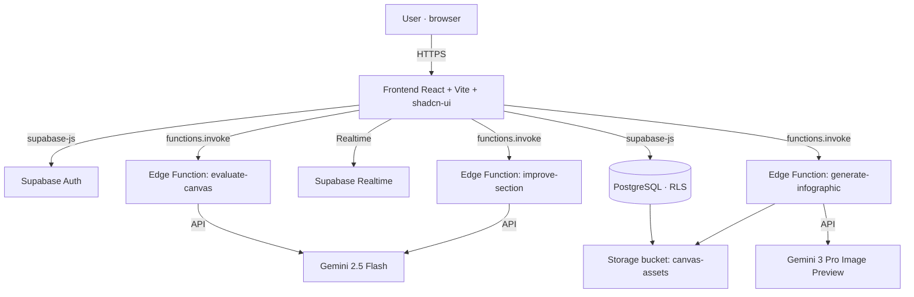

# Challenge Canvas Builder — Documentation (EN)

> A web tool to diagnose complex problems and structure organizational challenges
> before jumping to solutions. It pairs a twelve-block canvas with AI assistance
> (Google Gemini) and real-time collaboration.
>
> **Product:** Challenge Canvas Builder · **Author:** Diocélio Goulart ·
> **Domain:** [challengecanvas.com](https://challengecanvas.com) ·
> **Repository:** [professordyx/challenge-canvas](https://github.com/professordyx/challenge-canvas)

🌐 Languages: [Português](./pt-BR.md) · **English (this document)** · [Español](./es.md)

---

## Table of contents

1. [What Challenge Canvas Builder is](#1-what-challenge-canvas-builder-is)
2. [Who this documentation is for](#2-who-this-documentation-is-for)
3. [Features](#3-features)
4. [The Challenge Canvas: the twelve blocks](#4-the-challenge-canvas-the-twelve-blocks)
5. [Technical architecture](#5-technical-architecture)
6. [Data model](#6-data-model)
7. [The AI functions](#7-the-ai-functions)
8. [Running it locally](#8-running-it-locally)
9. [How the artifact was built: the Design Science Research trail](#9-how-the-artifact-was-built-the-design-science-research-trail)
10. [Artifact evaluation](#10-artifact-evaluation)
11. [Conceptual grounding](#11-conceptual-grounding)
12. [Limitations and roadmap](#12-limitations-and-roadmap)
13. [Relationship with the academic article](#13-relationship-with-the-academic-article)
14. [References (APA 7)](#14-references-apa-7)
15. [License and authorship](#15-license-and-authorship)

---

## 1. What Challenge Canvas Builder is

Teams facing hard organizational problems tend to jump to a solution before they
understand the problem. Challenge Canvas Builder exists to interrupt that jump. It
provides a structured board — the *Challenge Canvas* — that forces a team to state
context, problem, impact, stakeholders, and success criteria before proposing any
solution.

The product is a responsive web application (desktop and tablet). Each challenge is
stored in a database, can be assessed by an AI assistant, and can be shared with
others for joint editing. The tool was conceived and developed by Diocélio Goulart
as a research artifact in business administration, under the lens of Design Science
Research (DSR); Section 9 describes that construction trail.

This documentation describes the product as it is implemented in this repository.
Where earlier promotional material and the code diverge, the text follows the code.

## 2. Who this documentation is for

There are two audiences with distinct needs:

- **Developers.** They want the stack, the data model, the service boundaries, how
  to run the project, and how the AI is invoked. Sections 5 through 8 serve them.
- **Business and management readers.** They want to understand what the product
  solves, how to fill in a canvas, and why it raises the quality of problem
  definition. Sections 1, 3, 4, and 11 serve them.

Section 9, on the construction method, matters to both groups: it records the
design decisions and the evidence behind them.

## 3. Features

| Feature | What it does | Where it lives in code |
|---|---|---|
| Authentication | Email/password sign-up and login; protected routes | `src/hooks/useAuth.tsx`, `src/pages/Auth.tsx` |
| Dashboard | List of challenges with title, status, and date; create, open, delete | `src/pages/Dashboard.tsx`, `src/hooks/useChallenges.tsx` |
| Canvas editor | Twelve-block form with automatic save (debounced) | `src/pages/CanvasEditor.tsx` |
| Improve with AI | Rewrites a section's text for clarity and focus (streaming response) | `supabase/functions/improve-section` |
| Evaluate Canvas | Scores the canvas 0–100, classifies its level, suggests improvements | `supabase/functions/evaluate-canvas` |
| Generate infographic | Produces an AI summary image of the challenge | `supabase/functions/generate-infographic` |
| Voice input | Dictation via the Web Speech API (pt-BR and es-ES) | `src/hooks/useSpeechToText.ts`, `src/components/MicButton.tsx` |
| Sharing | Invites another person as viewer or editor, with real-time updates | `src/components/ShareDialog.tsx`, `challenge_shares` table |
| Built-in manual | Conceptual manual page inside the app (PT/ES) | `src/pages/Manual.tsx` |
| Bilingual | Portuguese and Spanish interface, with a persisted preference | `src/i18n/` |

A note on languages: the **product interface and AI responses** operate in
Portuguese and Spanish (`type Language = "pt" | "es"`). English is not present in
the application. This documentation, by contrast, is provided in three languages at
the author's request, to reach the international developer community.

## 4. The Challenge Canvas: the twelve blocks

The canvas reduces a complex problem to a single page. The product's data model
(`src/types/challenge.ts`, interface `CanvasFields`) defines twelve fields:

| # | Block | Key in code | Guiding question |
|---|---|---|---|
| 1 | Strategic context | `strategic_context` | Why does this challenge matter now? |
| 2 | Current problem | `problem` | What is observed, with data and root causes? |
| 3 | Impact | `impact` | What are the quantifiable consequences? |
| 4 | Stakeholders / users | `stakeholders` | Who is affected and who decides? |
| 5 | Challenge statement | `challenge_statement` | "How might we…?" (HMW format) |
| 6 | Success criteria | `success_metrics` | Which indicators prove it is solved? |
| 7 | Constraints and assumptions | `constraints` | What is fixed and what is a hypothesis? |
| 8 | Available resources | `resources` | Which data, teams, and partners help? |
| 9 | Initial hypotheses | `hypotheses` | Which assumptions will be tested? |
| 10 | Solution approach | `solution_approach` | How to attack the problem (at a high level)? |
| 11 | Governance | `governance` | Who sponsors, who leads, when is it reviewed? |
| 12 | Expected deliverables | `deliverables` | Which prototypes, pilots, and plans result? |

The challenge statement (block 5) uses the *How Might We* pattern — "How might we
[goal] for [audience] given [constraint]?". The wording is outcome-oriented rather
than solution-prescriptive, which keeps the solution space open.

## 5. Technical architecture

The product follows a Jamstack architecture: a static frontend served from the
edge, sensitive logic in serverless functions, and a managed backend (Supabase) for
database, authentication, storage, and real time.



**Presentation layer.** React 18 with TypeScript, bundled by Vite 5. UI components
based on shadcn-ui over Radix UI, styling with Tailwind CSS 3, animation with
Framer Motion, routing with React Router 6, and server state with TanStack Query 5.
Forms with React Hook Form and validation with Zod.

**Routes** (`src/App.tsx`): `/` (landing), `/auth` (login/sign-up), `/dashboard`
(protected), `/canvas/:id` (editor, protected), and `/manual` (protected).
Protected routes require an authenticated session.

**Service layer.** Three Deno edge functions (Supabase Edge Functions), each
isolating one AI call. The functions are set with `verify_jwt = false`
(`supabase/config.toml`) and open CORS, which suits a controlled-use MVP; Section 12
records the recommendation to harden this.

**Data layer.** PostgreSQL managed by Supabase, with Row-Level Security (RLS)
enabled on all application tables. Object storage for the generated infographics. A
real-time channel reflects shares.

**Build and hosting.** The project originated on Lovable; repository and platform
changes stay in sync. Package management with Bun and npm (both lockfiles are
committed). Testing with Vitest and Testing Library.

## 6. Data model

Three tables support the product (see `supabase/migrations/`).

**`profiles`** — user profile, created automatically on sign-up by the
`handle_new_user` trigger. Fields: `user_id` (FK to `auth.users`), `display_name`,
`avatar_url`, `preferred_language` (default `pt`).

**`challenges`** — the challenge itself. Fields: `title`, `status` (default
`rascunho`), `sections` (JSONB holding the twelve blocks), `evaluation` (JSONB with
the AI assessment result), `infographic_url` (link to storage). Timestamps with an
automatic update trigger.

**`challenge_shares`** — shares. Fields: `challenge_id`, `owner_id`,
`shared_with_id`, `permission` (`viewer` or `editor`). The table is added to the
`supabase_realtime` publication, which backs the live updates.

**Row-Level Security (RLS).** Policies ensure each person sees and edits only what
belongs to them or was shared with them. Examples verified in the migrations: the
owner sees their challenges; a recipient shared as `editor` can update the
challenge; the `find_user_by_email` function (with `SECURITY DEFINER`) resolves an
email invitation without exposing the authentication table.

The `Evaluation` type (in `src/types/challenge.ts`) mirrors the assessment
response: `score` (0–100), `level`, `summary`, `sections` (per-block feedback), and
`recommendations` (a list of recommendations).

## 7. The AI functions

The AI assistant uses Google Gemini. This is a point where the code corrects
earlier promotional material that mentioned "GPT-4/5": **the current implementation
calls the Gemini API.**

**`improve-section`** — takes a block's text and rewrites it for clarity,
completeness, and strategic focus. It uses `gemini-2.5-flash` in *streaming* mode
(SSE), and the content returns to the editor as it is generated. The prompt
explicitly instructs the model not to use Markdown, keeping clean text in the
canvas.

**`evaluate-canvas`** — takes the whole canvas and the title and returns
structured JSON with a score from 0 to 100, a level (`weak`, `adequate`, or
`strategic`), a summary, per-section feedback, and recommendations. It uses
`gemini-2.5-flash`. There is explicit rate-limit handling (HTTP 429) and a
*fallback* when the JSON cannot be parsed.

**`generate-infographic`** — assembles a visual prompt from the filled blocks and
generates a summary image with `gemini-3-pro-image-preview`. The image is stored in
the `canvas-assets` bucket and the link is kept in `challenges.infographic_url`.

All three functions receive a `language` parameter and respond in Portuguese or
Spanish according to the user's preference. The Gemini API key is read from the
server environment (`Deno.env.get("Gemini_API_KEY")`), so it never travels through
the client nor is committed to the repository.

## 8. Running it locally

Prerequisites: Node.js and npm (or Bun). The frontend reads three Supabase
environment variables at build time.

```bash
# 1. Clone
git clone https://github.com/professordyx/challenge-canvas.git
cd challenge-canvas

# 2. Install dependencies
npm install        # or: bun install

# 3. Configure environment (do not commit secrets)
#    Create a .env file with your Supabase project variables:
#    VITE_SUPABASE_URL, VITE_SUPABASE_PUBLISHABLE_KEY, VITE_SUPABASE_PROJECT_ID

# 4. Run in development
npm run dev        # Vite starts a server with hot reload

# 5. Tests and build
npm run test       # Vitest
npm run build      # production build
```

The edge functions and the database live on Supabase. For your own environment,
provision a Supabase project, apply the migrations in `supabase/migrations/`,
deploy the functions in `supabase/functions/`, and set the `Gemini_API_KEY` secret
in the functions environment.

> **Security note.** The repository commits a `.env` file containing
> `VITE_SUPABASE_URL`, `VITE_SUPABASE_PUBLISHABLE_KEY`, and
> `VITE_SUPABASE_PROJECT_ID`. The Supabase *publishable/anon* key is designed for
> client use and is guarded by RLS policies, so exposure carries limited risk.
> Even so, the recommended practice is to remove `.env` from version control (add
> it to `.gitignore`) and inject these variables through the build environment. The
> Gemini key, being a server secret, is correctly absent from `.env`.

## 9. How the artifact was built: the Design Science Research trail

This section is the complementary documentation of the research steps. It explains
how Challenge Canvas Builder was conceived as an artifact, following the Design
Science Research methodology of Peffers et al. (2007), with the evaluation criteria
of Hevner et al. (2004). The purpose here is engineering and practice: to record
the decisions and their evidence. The formal academic argumentation belongs to the
article described in Section 13.

Design Science Research investigates problems by building and evaluating artifacts —
constructs, models, methods, and instantiations (March & Smith, 1995). Challenge
Canvas Builder is an *instantiation*: software that materializes a problem-framing
method. The six activities of Peffers et al. (2007) organized the work.

**Activity 1 — Problem identification and motivation.** Complex organizational
problems have the nature of *wicked problems*: they admit no definitively right
solution, and the problem statement only becomes clear as one tries to solve it
(Rittel & Webber, 1973). Teams that jump to a solution waste innovation effort. In
open innovation, the clear articulation of a challenge raises collaboration between
a company and startups (Pinto & Tamanine, 2022). The design problem, then, is the
absence of a digital tool that disciplines framing before solution.

**Activity 2 — Objectives of a solution.** From the problem, objectives for the
artifact were set: (a) reduce a complex problem to a single structured page; (b)
impose blocks that separate symptom, cause, impact, and success criterion; (c)
offer a *How Might We* statement, oriented to outcomes; (d) support the user with AI
suggestions for clarity, metrics, and critique of the whole; (e) allow
collaborative use. These objectives derive both from design thinking (Brown, 2008;
Dorst, 2011) and from innovation-canvas practice (Pinto & Tamanine, 2022).

**Activity 3 — Design and development.** The artifact was built with the stack
described in Sections 5 through 7. The design decisions translate the objectives
into concrete mechanisms: the twelve `CanvasFields` blocks operationalize the
separation required in objective (b); the `improve-section` function serves the
clarity in objective (d); `evaluate-canvas` materializes the critique of the whole;
`challenge_shares` and the real-time channel serve objective (e). Cognitive
diversity, which improves problem definition (Page, 2007), is supported by sharing
with viewer and editor roles.

**Activity 4 — Demonstration.** Use of the artifact was demonstrated with an
illustrative case of an online retailer with a high churn rate: the canvas leads
from the problem description (checkout experience, delivery delays) to a measurable
statement ("How might we cut churn by 20% in 12 months for repeat buyers without
raising CAC?"), success criteria, and deliverables. The flow shows that the tool
keeps focus on the problem and defers solution prescription.

**Activity 5 — Evaluation.** The artifact embeds an instrumented evaluation
mechanism: the `evaluate-canvas` function scores the result and flags gaps,
operating as an automated critique of the framing. Section 10 details this and
records, transparently, what has not yet been evaluated empirically.

**Activity 6 — Communication.** The knowledge generated is communicated on three
layers: this repository and its documentation, the manual embedded in the product,
and the academic article in preparation (Section 13).

The presentation above follows Gregor and Hevner's (2013) recommendation to make
design decisions and their justification explicit, so that third parties can
evaluate and reuse the artifact.

## 10. Artifact evaluation

There are two planes of evaluation, and they must be separated honestly.

**Evaluation embedded in the product.** The `evaluate-canvas` function applies an
AI-based evaluator that returns a score (0–100), a level, and per-block
recommendations. This mechanism serves the user's self-critique while filling in
the canvas. It assesses the *framing quality* of each challenge, not the artifact
as a whole.

**Evaluation of the artifact as a research contribution.** According to Hevner et
al. (2004), a DSR artifact must be evaluated for utility, quality, and efficacy by
appropriate methods (observational, analytical, experimental, testing, or
descriptive). In the current state of this repository, the evaluation performed is
descriptive and demonstrative (Section 9, Activity 4). An empirical evaluation with
users — for example, comparing the quality of challenge statements with and without
the tool, or measuring time and inter-rater agreement — has not yet been conducted
in this repository. **This cannot be asserted with the available data** and is
reserved for the academic work in progress.

## 11. Conceptual grounding

The artifact rests on four ideas, each anchored in the literature.

**Complex problems require reframing before solving.** In *wicked problems* there
is no right or wrong solution, only better or worse given current conditions, and
the problem clarifies only as one tries to solve it (Rittel & Webber, 1973). Hence
the canvas's emphasis on definition before prescription.

**Design thinking starts with framing.** Design thinking begins with a deep
understanding of the user and context (Brown, 2008), and its core is the creation
of *frames* — viewpoints from which the problem becomes approachable (Dorst, 2011).
The *How Might We* block is a framing device.

**Cognitive diversity improves problem definition.** Cognitively diverse groups can
outperform high-ability groups in solving complex problems (Page, 2007). Sharing
with viewer and editor roles exists to bring distinct viewpoints to the canvas.

**The canvas and open innovation.** Reducing a problem to one page eases
communication and pattern recognition; in open innovation, systematizing a
challenge in visual form increases collaboration between companies and startups
(Pinto & Tamanine, 2022). In complex settings, leadership operates by
experimentation — probe, sense patterns, and respond (Snowden & Boone, 2007), which
reinforces the prototype-and-hypothesis practice embedded in the hypotheses block.

## 12. Limitations and roadmap

**Known limitations.**

- The edge functions use `verify_jwt = false` and open CORS. For public-facing use,
  requiring JWT and restricting origins is recommended.
- The `.env` file is committed (see the security note in Section 8).
- The interface and the AI cover Portuguese and Spanish; there is no English in the
  application.
- The challenge is exported as an AI-generated infographic. There is no PDF or Word
  export through a dedicated library in the current code.
- Empirical evaluation of the artifact with users has not yet been conducted
  (Section 10).

**Possible directions.** Hardening function security; removing `.env` from version
control; a library of canvas templates; structured document export; and the
empirical evaluation study described in Section 13.

## 13. Relationship with the academic article

This repository is the engineering and practice companion to the artifact. The
formal academic treatment — full theoretical grounding, the DSR methodological
protocol, empirical evaluation, and a discussion of contribution — will be
presented in an article to be submitted to SEMEAD and to journals.

To avoid textual overlap with that article (and the risk of self-plagiarism at
submission time), this documentation was written in its own register, aimed at the
developer and management communities, and does not reproduce the academic prose.
The references are shared because the conceptual base is the same; the argument, the
structure, and the analytical depth of the article remain exclusive to the academic
work.

## 14. References (APA 7)

Brown, T. (2008). Design thinking. *Harvard Business Review, 86*(6), 84–92.

Chesbrough, H. W. (2003). *Open innovation: The new imperative for creating and profiting from technology.* Harvard Business School Press.

Dorst, K. (2011). The core of "design thinking" and its application. *Design Studies, 32*(6), 521–532. https://doi.org/10.1016/j.destud.2011.07.006

Gregor, S., & Hevner, A. R. (2013). Positioning and presenting design science research for maximum impact. *MIS Quarterly, 37*(2), 337–355. https://doi.org/10.25300/MISQ/2013/37.2.01

Hevner, A. R., March, S. T., Park, J., & Ram, S. (2004). Design science in information systems research. *MIS Quarterly, 28*(1), 75–105. https://doi.org/10.2307/25148625

March, S. T., & Smith, G. F. (1995). Design and natural science research on information technology. *Decision Support Systems, 15*(4), 251–266. https://doi.org/10.1016/0167-9236(94)00041-2

Page, S. E. (2007). *The difference: How the power of diversity creates better groups, firms, schools, and societies.* Princeton University Press.

Peffers, K., Tuunanen, T., Rothenberger, M. A., & Chatterjee, S. (2007). A design science research methodology for information systems research. *Journal of Management Information Systems, 24*(3), 45–77. https://doi.org/10.2753/MIS0742-1222240302

Pinto, T. d. C. L., & Tamanine, A. M. B. (2022). Corporate challenge canvas: Visual tool to systematize open innovation challenges. *Revista Brasileira de Gestão e Inovação, 10*(1), 146–170. https://doi.org/10.18226/23190639.v10n1.07

Rittel, H. W. J., & Webber, M. M. (1973). Dilemmas in a general theory of planning. *Policy Sciences, 4*(2), 155–169. https://doi.org/10.1007/BF01405730

Snowden, D. J., & Boone, M. E. (2007). A leader's framework for decision making. *Harvard Business Review, 85*(11), 68–76.

Sneij, J. (2019). *The challenge canvas — Find focus before designing into the wild.* Medium. https://medium.com/swlh/the-challenge-canvas-822c00750e32

## 15. License and authorship

Developed by **Diocélio Goulart** — © 2026. All rights reserved. For licensing and
use, consult the author or the repository's license file, when available.
