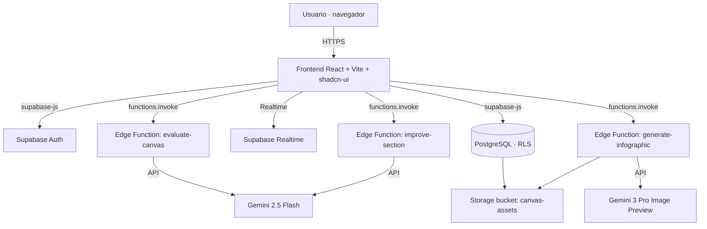

# Challenge Canvas Builder — Documentación (ES)

> Herramienta web para diagnosticar problemas complejos y estructurar desafíos
> organizacionales antes de pasar a la solución. Combina un lienzo de doce bloques
> con asistencia de IA (Google Gemini) y colaboración en tiempo real.
>
> **Producto:** Challenge Canvas Builder · **Autoría:** Diocélio Goulart ·
> **Dominio:** [challengecanvas.com](https://challengecanvas.com) ·
> **Repositorio:** [professordyx/challenge-canvas](https://github.com/professordyx/challenge-canvas)

🌐 Idiomas: [Português](./pt-BR.md) · [English](./en.md) · **Español (este documento)**

---

## Índice

1. [Qué es Challenge Canvas Builder](#1-qué-es-challenge-canvas-builder)
2. [Para quién es esta documentación](#2-para-quién-es-esta-documentación)
3. [Funcionalidades](#3-funcionalidades)
4. [El Challenge Canvas: los doce bloques](#4-el-challenge-canvas-los-doce-bloques)
5. [Arquitectura técnica](#5-arquitectura-técnica)
6. [Modelo de datos](#6-modelo-de-datos)
7. [Las funciones de IA](#7-las-funciones-de-ia)
8. [Cómo ejecutarlo localmente](#8-cómo-ejecutarlo-localmente)
9. [Cómo se construyó el artefacto: la ruta Design Science Research](#9-cómo-se-construyó-el-artefacto-la-ruta-design-science-research)
10. [Evaluación del artefacto](#10-evaluación-del-artefacto)
11. [Fundamentación conceptual](#11-fundamentación-conceptual)
12. [Limitaciones y hoja de ruta](#12-limitaciones-y-hoja-de-ruta)
13. [Relación con el artículo académico](#13-relación-con-el-artículo-académico)
14. [Referencias (APA 7)](#14-referencias-apa-7)
15. [Licencia y autoría](#15-licencia-y-autoría)

---

## 1. Qué es Challenge Canvas Builder

Los equipos que enfrentan problemas organizacionales difíciles tienden a saltar a
la solución antes de entender el problema. Challenge Canvas Builder existe para
interrumpir ese salto. Ofrece un tablero estructurado —el *Challenge Canvas*— que
obliga al equipo a enunciar contexto, problema, impacto, partes interesadas y
criterios de éxito antes de proponer cualquier solución.

El producto es una aplicación web responsiva (escritorio y tableta). Cada desafío
se guarda en una base de datos, puede ser evaluado por un asistente de IA y
compartirse con otras personas para la edición conjunta. La herramienta fue
concebida y desarrollada por Diocélio Goulart como artefacto de investigación en
administración, bajo la lente de Design Science Research (DSR); la sección 9
describe esa ruta de construcción.

Esta documentación describe el producto tal como está implementado en este
repositorio. Donde el material de difusión anterior y el código divergen, el texto
sigue al código.

## 2. Para quién es esta documentación

Hay dos públicos con necesidades distintas:

- **Personas de desarrollo.** Quieren conocer el stack, el modelo de datos, las
  fronteras de servicio, cómo ejecutar el proyecto y cómo se invoca la IA. Las
  secciones 5 a 8 las atienden.
- **Personas de negocio y gestión.** Quieren entender qué resuelve el producto,
  cómo completar un lienzo y por qué eleva la calidad de la definición de
  problemas. Las secciones 1, 3, 4 y 11 las atienden.

La sección 9, sobre el método de construcción, interesa a ambos grupos: registra
las decisiones de diseño y la evidencia que las sostiene.

## 3. Funcionalidades

| Funcionalidad | Qué hace | Dónde vive en el código |
|---|---|---|
| Autenticación | Registro e inicio de sesión por correo/contraseña; rutas protegidas | `src/hooks/useAuth.tsx`, `src/pages/Auth.tsx` |
| Panel | Lista de desafíos con título, estado y fecha; crear, abrir y eliminar | `src/pages/Dashboard.tsx`, `src/hooks/useChallenges.tsx` |
| Editor de lienzo | Formulario de doce bloques con guardado automático (debounce) | `src/pages/CanvasEditor.tsx` |
| Mejorar con IA | Reescribe el texto de una sección con más claridad y foco (respuesta en streaming) | `supabase/functions/improve-section` |
| Evaluar lienzo | Puntúa el lienzo de 0 a 100, clasifica el nivel y sugiere mejoras | `supabase/functions/evaluate-canvas` |
| Generar infografía | Produce una imagen-resumen del desafío con IA | `supabase/functions/generate-infographic` |
| Entrada por voz | Dictado de texto vía Web Speech API (pt-BR y es-ES) | `src/hooks/useSpeechToText.ts`, `src/components/MicButton.tsx` |
| Compartir | Invita a otra persona como lectora o editora, con actualización en tiempo real | `src/components/ShareDialog.tsx`, tabla `challenge_shares` |
| Manual integrado | Página de manual conceptual dentro de la app (PT/ES) | `src/pages/Manual.tsx` |
| Bilingüe | Interfaz en Portugués y Español, con preferencia persistida | `src/i18n/` |

Nota sobre los idiomas: la **interfaz y las respuestas de IA del producto** operan
en Portugués y Español (`type Language = "pt" | "es"`). El Inglés no está presente
en la aplicación. Esta documentación, en cambio, se ofrece en tres idiomas a
pedido del autor, para alcanzar a la comunidad de desarrollo internacional.

## 4. El Challenge Canvas: los doce bloques

El lienzo reduce un problema complejo a una sola página. El modelo de datos del
producto (`src/types/challenge.ts`, interfaz `CanvasFields`) define doce campos:

| # | Bloque | Clave en el código | Pregunta-guía |
|---|---|---|---|
| 1 | Contexto estratégico | `strategic_context` | ¿Por qué importa este desafío ahora? |
| 2 | Problema actual | `problem` | ¿Qué se observa, con datos y causas raíz? |
| 3 | Impacto | `impact` | ¿Cuáles son las consecuencias cuantificables? |
| 4 | Partes interesadas / usuarios | `stakeholders` | ¿Quién es afectado y quién decide? |
| 5 | Declaración del desafío | `challenge_statement` | "¿Cómo podríamos…?" (formato HMW) |
| 6 | Criterios de éxito | `success_metrics` | ¿Qué indicadores prueban la resolución? |
| 7 | Restricciones y premisas | `constraints` | ¿Qué es fijo y qué es hipótesis? |
| 8 | Recursos disponibles | `resources` | ¿Qué datos, equipos y alianzas apoyan? |
| 9 | Hipótesis iniciales | `hypotheses` | ¿Qué supuestos se pondrán a prueba? |
| 10 | Enfoque de solución | `solution_approach` | ¿Cómo atacar el problema (en alto nivel)? |
| 11 | Gobernanza | `governance` | ¿Quién patrocina, quién lidera, cuándo se revisa? |
| 12 | Entregables esperados | `deliverables` | ¿Qué prototipos, pilotos y planes resultan? |

La declaración del desafío (bloque 5) usa el patrón *How Might We* — "¿Cómo
podríamos [objetivo] para [público] considerando [restricción]?". El enunciado está
orientado al resultado, no es prescriptivo de la solución, lo que mantiene abierto
el espacio de soluciones.

## 5. Arquitectura técnica

El producto sigue una arquitectura Jamstack: frontend estático servido desde el
borde, lógica sensible en funciones serverless y un backend gestionado (Supabase)
para base de datos, autenticación, almacenamiento y tiempo real.



**Capa de presentación.** React 18 con TypeScript, empaquetado por Vite 5.
Componentes de interfaz basados en shadcn-ui sobre Radix UI, estilos con Tailwind
CSS 3, animaciones con Framer Motion, enrutamiento con React Router 6 y estado de
servidor con TanStack Query 5. Formularios con React Hook Form y validación con Zod.

**Rutas** (`src/App.tsx`): `/` (landing), `/auth` (inicio de sesión/registro),
`/dashboard` (protegida), `/canvas/:id` (editor, protegida) y `/manual`
(protegida). Las rutas protegidas exigen una sesión autenticada.

**Capa de servicio.** Tres funciones de borde en Deno (Supabase Edge Functions),
cada una aislando una llamada a la IA. Las funciones tienen `verify_jwt = false`
(`supabase/config.toml`) y CORS abierto, decisión adecuada a un MVP de uso
controlado; la sección 12 registra la recomendación de endurecer este punto.

**Capa de datos.** PostgreSQL gestionado por Supabase, con Row-Level Security (RLS)
habilitada en todas las tablas de aplicación. Almacenamiento de objetos para las
infografías generadas. Un canal de tiempo real refleja los recursos compartidos.

**Compilación y alojamiento.** El proyecto se originó en Lovable; los cambios en el
repositorio y en la plataforma se sincronizan. Gestión de paquetes con Bun y npm
(ambos lockfiles están versionados). Pruebas con Vitest y Testing Library.

## 6. Modelo de datos

Tres tablas sostienen el producto (ver `supabase/migrations/`).

**`profiles`** — perfil del usuario, creado automáticamente en el registro por el
disparador `handle_new_user`. Campos: `user_id` (FK a `auth.users`),
`display_name`, `avatar_url`, `preferred_language` (predeterminado `pt`).

**`challenges`** — el desafío en sí. Campos: `title`, `status` (predeterminado
`rascunho`), `sections` (JSONB con los doce bloques), `evaluation` (JSONB con el
resultado de la evaluación por IA), `infographic_url` (enlace al almacenamiento).
Marcas de tiempo con disparador de actualización automática.

**`challenge_shares`** — recursos compartidos. Campos: `challenge_id`, `owner_id`,
`shared_with_id`, `permission` (`viewer` o `editor`). La tabla se incluye en la
publicación `supabase_realtime`, lo que sostiene la actualización en vivo.

**Seguridad por fila (RLS).** Las políticas garantizan que cada persona vea y edite
solo lo que le pertenece o se compartió con ella. Ejemplos verificados en las
migraciones: el propietario ve sus desafíos; quien recibe un recurso compartido
como `editor` puede actualizar el desafío; la función `find_user_by_email` (con
`SECURITY DEFINER`) resuelve la invitación por correo sin exponer la tabla de
autenticación.

El tipo `Evaluation` (en `src/types/challenge.ts`) refleja la respuesta de la
evaluación: `score` (0–100), `level`, `summary`, `sections` (retroalimentación por
bloque) y `recommendations` (lista de recomendaciones).

## 7. Las funciones de IA

El asistente de IA usa Google Gemini. Este es un punto en que el código corrige
material de difusión anterior que mencionaba "GPT-4/5": **la implementación actual
llama a la API de Gemini.**

**`improve-section`** — recibe el texto de un bloque y lo reescribe con más
claridad, completitud y foco estratégico. Usa `gemini-2.5-flash` en modo
*streaming* (SSE), y el contenido vuelve al editor a medida que se genera. El
prompt instruye explícitamente a no usar Markdown, preservando texto limpio en el
lienzo.

**`evaluate-canvas`** — recibe el lienzo completo y el título y devuelve un JSON
estructurado con puntuación de 0 a 100, nivel (`débil`, `adecuado` o
`estratégico`), resumen, retroalimentación por sección y recomendaciones. Usa
`gemini-2.5-flash`. Hay manejo explícito del límite de tasa (HTTP 429) y un
*fallback* cuando el JSON no puede interpretarse.

**`generate-infographic`** — arma un prompt visual a partir de los bloques
completados y genera una imagen-resumen con `gemini-3-pro-image-preview`. La imagen
se almacena en el bucket `canvas-assets` y el enlace queda en
`challenges.infographic_url`.

Las tres funciones reciben el parámetro `language` y responden en Portugués o
Español según la preferencia del usuario. La clave de la API de Gemini se lee del
entorno del servidor (`Deno.env.get("Gemini_API_KEY")`), por lo que no viaja por el
cliente ni se versiona en el repositorio.

## 8. Cómo ejecutarlo localmente

Requisitos previos: Node.js y npm (o Bun). El frontend lee tres variables de
entorno de Supabase en tiempo de compilación.

```bash
# 1. Clonar
git clone https://github.com/professordyx/challenge-canvas.git
cd challenge-canvas

# 2. Instalar dependencias
npm install        # o: bun install

# 3. Configurar el entorno (no versiones secretos)
#    Crea un archivo .env con las variables de tu proyecto Supabase:
#    VITE_SUPABASE_URL, VITE_SUPABASE_PUBLISHABLE_KEY, VITE_SUPABASE_PROJECT_ID

# 4. Ejecutar en desarrollo
npm run dev        # Vite levanta un servidor con recarga en caliente

# 5. Pruebas y compilación
npm run test       # Vitest
npm run build      # compilación de producción
```

Las funciones de borde y la base de datos viven en Supabase. Para un entorno
propio, aprovisiona un proyecto Supabase, aplica las migraciones de
`supabase/migrations/`, publica las funciones de `supabase/functions/` y define el
secreto `Gemini_API_KEY` en el entorno de las funciones.

> **Nota de seguridad.** El repositorio versiona un archivo `.env` que contiene
> `VITE_SUPABASE_URL`, `VITE_SUPABASE_PUBLISHABLE_KEY` y
> `VITE_SUPABASE_PROJECT_ID`. La clave *publishable/anon* de Supabase está diseñada
> para uso en el cliente y está protegida por las políticas de RLS, por lo que la
> exposición tiene un riesgo contenido. Aun así, la práctica recomendada es retirar
> el `.env` del control de versiones (agregarlo al `.gitignore`) e inyectar esas
> variables mediante el entorno de compilación. La clave de Gemini, por ser secreto
> de servidor, correctamente no aparece en el `.env`.

## 9. Cómo se construyó el artefacto: la ruta Design Science Research

Esta sección es la documentación complementaria de los pasos de investigación.
Explica cómo Challenge Canvas Builder fue concebido como artefacto, siguiendo la
metodología de Design Science Research de Peffers et al. (2007), con los criterios
de evaluación de Hevner et al. (2004). El propósito aquí es de ingeniería y
práctica: registrar las decisiones y su evidencia. La argumentación académica
formal pertenece al artículo descrito en la sección 13.

Design Science Research investiga problemas mediante la construcción y evaluación de
artefactos —constructos, modelos, métodos e instanciaciones (March & Smith, 1995).
Challenge Canvas Builder es una *instanciación*: software que materializa un método
de encuadre de problemas. Las seis actividades de Peffers et al. (2007) organizaron
el trabajo.

**Actividad 1 — Identificación del problema y motivación.** Los problemas
organizacionales complejos tienen la naturaleza de *wicked problems*: no admiten una
solución definitivamente correcta, y el enunciado del problema solo se aclara al
intentar resolverlo (Rittel & Webber, 1973). Los equipos que saltan a la solución
desperdician esfuerzo de innovación. En innovación abierta, la articulación clara de
un desafío eleva la colaboración entre la empresa y las startups (Pinto & Tamanine,
2022). El problema de diseño, entonces, es la ausencia de una herramienta digital
que discipline el encuadre antes de la solución.

**Actividad 2 — Objetivos de la solución.** A partir del problema, se fijaron
objetivos para el artefacto: (a) reducir un problema complejo a una sola página
estructurada; (b) imponer bloques que separen síntoma, causa, impacto y criterio de
éxito; (c) ofrecer un enunciado en formato *How Might We*, orientado al resultado;
(d) apoyar al usuario con sugerencias de IA para la claridad, las métricas y la
crítica del conjunto; (e) permitir el uso colaborativo. Estos objetivos derivan
tanto del pensamiento de diseño (Brown, 2008; Dorst, 2011) como de la práctica de
lienzos de innovación (Pinto & Tamanine, 2022).

**Actividad 3 — Diseño y desarrollo.** El artefacto se construyó con el stack
descrito en las secciones 5 a 7. Las decisiones de diseño traducen los objetivos en
mecanismos concretos: los doce bloques de `CanvasFields` operacionalizan la
separación exigida en el objetivo (b); la función `improve-section` atiende la
claridad del objetivo (d); `evaluate-canvas` materializa la crítica del conjunto;
`challenge_shares` y el canal de tiempo real atienden el objetivo (e). La diversidad
cognitiva, que mejora la definición de problemas (Page, 2007), se apoya en el
compartir con roles de lector y editor.

**Actividad 4 — Demostración.** El uso del artefacto se demostró con un caso
ilustrativo de comercio minorista en línea con alta tasa de *churn*: el lienzo
conduce de la descripción del problema (experiencia de pago, retrasos de entrega) a
un enunciado medible ("¿Cómo podríamos reducir el churn en un 20 % en 12 meses para
compradores recurrentes, sin aumentar el CAC?"), criterios de éxito y entregables.
El flujo demuestra que la herramienta mantiene el foco en el problema y aplaza la
prescripción de la solución.

**Actividad 5 — Evaluación.** El propio artefacto incorpora un mecanismo de
evaluación instrumentado: la función `evaluate-canvas` puntúa el resultado y señala
lagunas, operando como una crítica automatizada del encuadre. La sección 10 detalla
este punto y registra, con transparencia, lo que aún no se ha evaluado de forma
empírica.

**Actividad 6 — Comunicación.** El conocimiento generado se comunica en tres capas:
este repositorio y su documentación, el manual integrado al producto y el artículo
académico en preparación (sección 13).

La presentación anterior sigue la recomendación de Gregor y Hevner (2013) de hacer
explícitas las decisiones de diseño y su justificación, de modo que terceros puedan
evaluar y reutilizar el artefacto.

## 10. Evaluación del artefacto

Hay dos planos de evaluación, y conviene separarlos con honestidad.

**Evaluación incorporada al producto.** La función `evaluate-canvas` aplica un
evaluador basado en IA que devuelve puntuación (0–100), nivel y recomendaciones por
bloque. Este mecanismo sirve a la autocrítica del usuario durante el llenado. Evalúa
la *calidad del encuadre* de cada desafío, no el artefacto en su conjunto.

**Evaluación del artefacto como contribución de investigación.** Según Hevner et
al. (2004), un artefacto de DSR debe evaluarse por su utilidad, calidad y eficacia
mediante métodos apropiados (observacional, analítico, experimental, de prueba o
descriptivo). En el estado actual de este repositorio, la evaluación realizada es de
naturaleza descriptiva y demostrativa (sección 9, actividad 4). Una evaluación
empírica con usuarios —por ejemplo, comparar la calidad de los enunciados de desafío
con y sin la herramienta, o medir el tiempo y la concordancia entre evaluadores— aún
no se ha realizado en este repositorio. **Esto no puede afirmarse con los datos
disponibles** y queda reservado al trabajo académico en curso.

## 11. Fundamentación conceptual

El artefacto se apoya en cuatro ideas, cada una con respaldo en la literatura.

**Los problemas complejos exigen reformulación antes de la solución.** En los
*wicked problems* no hay solución correcta o incorrecta, solo mejores o peores dadas
las condiciones actuales, y el problema se aclara solo al intentar resolverlo
(Rittel & Webber, 1973). De ahí el énfasis del lienzo en la definición antes de la
prescripción.

**El pensamiento de diseño empieza por el encuadre.** El design thinking parte de
una comprensión profunda del usuario y del contexto (Brown, 2008), y su núcleo es la
creación de *frames* —puntos de vista desde los cuales el problema se vuelve
abordable (Dorst, 2011). El bloque *How Might We* es un dispositivo de encuadre.

**La diversidad cognitiva mejora la definición de problemas.** Los grupos
cognitivamente diversos pueden superar a los grupos de alta habilidad en la solución
de problemas complejos (Page, 2007). El compartir con roles de lector y editor
existe para traer puntos de vista distintos al lienzo.

**El lienzo y la innovación abierta.** Reducir un problema a una página facilita la
comunicación y la identificación de patrones; en innovación abierta, sistematizar un
desafío en formato visual aumenta la colaboración entre empresas y startups (Pinto &
Tamanine, 2022). En entornos complejos, el liderazgo opera por experimentación
—explorar, percibir patrones y reaccionar (Snowden & Boone, 2007), lo que refuerza
la práctica de prototipos e hipótesis incorporada al bloque de hipótesis.

## 12. Limitaciones y hoja de ruta

**Limitaciones conocidas.**

- Las funciones de borde usan `verify_jwt = false` y CORS abierto. Para un uso
  abierto al público, se recomienda exigir JWT y restringir los orígenes.
- El archivo `.env` está versionado (ver la nota de seguridad en la sección 8).
- La interfaz y la IA cubren Portugués y Español; no hay Inglés en la aplicación.
- El desafío se exporta como infografía generada por IA. No hay, en el código
  actual, exportación a PDF o Word mediante una biblioteca dedicada.
- La evaluación empírica del artefacto con usuarios aún no se ha realizado (sección
  10).

**Direcciones posibles.** Endurecimiento de la seguridad de las funciones;
retirada del `.env` del control de versiones; biblioteca de plantillas de lienzo;
exportación documental estructurada; y el estudio empírico de evaluación descrito en
la sección 13.

## 13. Relación con el artículo académico

Este repositorio es el compañero de ingeniería y práctica del artefacto. El
tratamiento académico formal —fundamentación teórica completa, protocolo
metodológico de DSR, evaluación empírica y discusión de la contribución— se
presentará en un artículo que se enviará al SEMEAD y a revistas.

Para evitar la superposición textual con ese artículo (y el riesgo de autoplagio al
momento de la presentación), esta documentación se redactó en un registro propio,
dirigido a las comunidades de desarrollo y de gestión, y no reproduce la prosa
académica. Las referencias se comparten porque la base conceptual es la misma; el
argumento, la estructura y la profundidad analítica del artículo permanecen
exclusivos del trabajo académico.

## 14. Referencias (APA 7)

Brown, T. (2008). Design thinking. *Harvard Business Review, 86*(6), 84–92.

Chesbrough, H. W. (2003). *Open innovation: The new imperative for creating and profiting from technology.* Harvard Business School Press.

Dorst, K. (2011). The core of "design thinking" and its application. *Design Studies, 32*(6), 521–532. https://doi.org/10.1016/j.destud.2011.07.006

Gregor, S., & Hevner, A. R. (2013). Positioning and presenting design science research for maximum impact. *MIS Quarterly, 37*(2), 337–355. https://doi.org/10.25300/MISQ/2013/37.2.01

Hevner, A. R., March, S. T., Park, J., & Ram, S. (2004). Design science in information systems research. *MIS Quarterly, 28*(1), 75–105. https://doi.org/10.2307/25148625

March, S. T., & Smith, G. F. (1995). Design and natural science research on information technology. *Decision Support Systems, 15*(4), 251–266. https://doi.org/10.1016/0167-9236(94)00041-2

Page, S. E. (2007). *The difference: How the power of diversity creates better groups, firms, schools, and societies.* Princeton University Press.

Peffers, K., Tuunanen, T., Rothenberger, M. A., & Chatterjee, S. (2007). A design science research methodology for information systems research. *Journal of Management Information Systems, 24*(3), 45–77. https://doi.org/10.2753/MIS0742-1222240302

Pinto, T. d. C. L., & Tamanine, A. M. B. (2022). Corporate challenge canvas: Visual tool to systematize open innovation challenges. *Revista Brasileira de Gestão e Inovação, 10*(1), 146–170. https://doi.org/10.18226/23190639.v10n1.07

Rittel, H. W. J., & Webber, M. M. (1973). Dilemmas in a general theory of planning. *Policy Sciences, 4*(2), 155–169. https://doi.org/10.1007/BF01405730

Snowden, D. J., & Boone, M. E. (2007). A leader's framework for decision making. *Harvard Business Review, 85*(11), 68–76.

Sneij, J. (2019). *The challenge canvas — Find focus before designing into the wild.* Medium. https://medium.com/swlh/the-challenge-canvas-822c00750e32

## 15. Licencia y autoría

Desarrollado por **Diocélio Goulart** — © 2026. Todos los derechos reservados. Para
licenciamiento y uso, consulta al autor o el archivo de licencia del repositorio,
cuando esté disponible.
