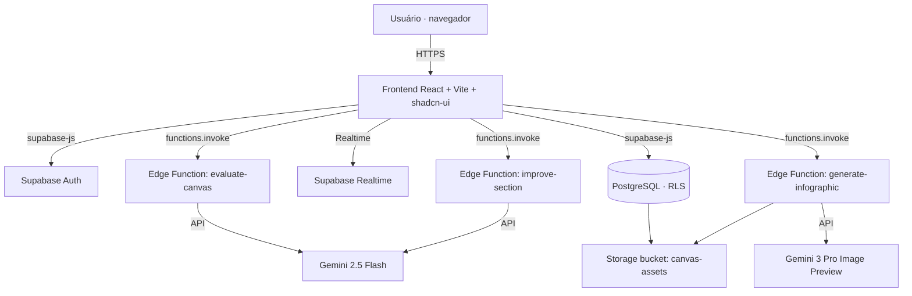

# Challenge Canvas Builder — Documentação (PT-BR)

> Ferramenta web para diagnosticar problemas complexos e estruturar desafios
> organizacionais antes de partir para a solução. Combina um canvas de doze
> blocos com assistência de IA (Google Gemini) e colaboração em tempo real.
>
> **Produto:** Challenge Canvas Builder · **Autoria:** Diocélio Goulart ·
> **Domínio:** [challengecanvas.com](https://challengecanvas.com) ·
> **Repositório:** [professordyx/challenge-canvas](https://github.com/professordyx/challenge-canvas)

🌐 Idiomas: **Português (este documento)** · [English](./en.md) · [Español](./es.md)

---

## Índice

1. [O que é o Challenge Canvas Builder](#1-o-que-é-o-challenge-canvas-builder)
2. [Para quem é esta documentação](#2-para-quem-é-esta-documentação)
3. [Funcionalidades](#3-funcionalidades)
4. [O Challenge Canvas: os doze blocos](#4-o-challenge-canvas-os-doze-blocos)
5. [Arquitetura técnica](#5-arquitetura-técnica)
6. [Modelo de dados](#6-modelo-de-dados)
7. [As funções de IA](#7-as-funções-de-ia)
8. [Como rodar localmente](#8-como-rodar-localmente)
9. [Como o artefato foi construído: a trilha Design Science Research](#9-como-o-artefato-foi-construído-a-trilha-design-science-research)
10. [Avaliação do artefato](#10-avaliação-do-artefato)
11. [Fundamentação conceitual](#11-fundamentação-conceitual)
12. [Limitações e roadmap](#12-limitações-e-roadmap)
13. [Relação com o artigo acadêmico](#13-relação-com-o-artigo-acadêmico)
14. [Referências (APA 7)](#14-referências-apa-7)
15. [Licença e autoria](#15-licença-e-autoria)

---

## 1. O que é o Challenge Canvas Builder

Equipes que enfrentam problemas organizacionais difíceis tendem a saltar para a
solução antes de entender o problema. O Challenge Canvas Builder existe para
interromper esse salto. Ele oferece um quadro estruturado — o *Challenge Canvas* —
que obriga a equipe a articular contexto, problema, impacto, partes interessadas e
critérios de sucesso antes de propor qualquer solução.

O produto é um aplicativo web responsivo (desktop e tablet). Cada desafio é salvo
em banco de dados, pode ser avaliado por um assistente de IA e compartilhado com
outras pessoas para edição conjunta. A ferramenta foi concebida e desenvolvida por
Diocélio Goulart como artefato de pesquisa em administração, sob a lente de Design
Science Research (DSR); a seção 9 descreve essa trilha de construção.

Esta documentação descreve o produto tal como ele está implementado no código
deste repositório. Onde o material de divulgação anterior e o código divergem, o
texto segue o código.

## 2. Para quem é esta documentação

Há dois públicos, com necessidades distintas:

- **Pessoas de desenvolvimento.** Querem saber a stack, o modelo de dados, as
  fronteiras de serviço, como rodar o projeto e como a IA é acionada. As seções 5
  a 8 atendem a esse público.
- **Pessoas de negócio e gestão.** Querem entender o que o produto resolve, como
  preencher um canvas e por que ele aumenta a qualidade da definição de problemas.
  As seções 1, 3, 4 e 11 atendem a esse público.

A seção 9, sobre o método de construção, interessa aos dois grupos: descreve as
decisões de projeto e as evidências que as sustentam.

## 3. Funcionalidades

| Funcionalidade | O que faz | Onde vive no código |
|---|---|---|
| Autenticação | Cadastro e login por e-mail/senha; rotas protegidas | `src/hooks/useAuth.tsx`, `src/pages/Auth.tsx` |
| Dashboard | Lista de desafios com título, status e data; criar, abrir e excluir | `src/pages/Dashboard.tsx`, `src/hooks/useChallenges.tsx` |
| Editor de Canvas | Formulário de doze blocos com salvamento automático (debounce) | `src/pages/CanvasEditor.tsx` |
| Melhorar com IA | Reescreve o texto de uma seção com mais clareza e foco (resposta em streaming) | `supabase/functions/improve-section` |
| Avaliar Canvas | Pontua o canvas de 0 a 100, classifica o nível e sugere melhorias | `supabase/functions/evaluate-canvas` |
| Gerar infográfico | Produz uma imagem-resumo do desafio por IA | `supabase/functions/generate-infographic` |
| Entrada por voz | Ditado de texto via Web Speech API (pt-BR e es-ES) | `src/hooks/useSpeechToText.ts`, `src/components/MicButton.tsx` |
| Compartilhamento | Convida outra pessoa como leitora ou editora, com atualização em tempo real | `src/components/ShareDialog.tsx`, tabela `challenge_shares` |
| Manual integrado | Página de manual conceitual dentro do app (PT/ES) | `src/pages/Manual.tsx` |
| Bilíngue | Interface em Português e Espanhol, com preferência persistida | `src/i18n/` |

Observação sobre idiomas: a **interface e as respostas de IA do produto** operam
em Português e Espanhol (`type Language = "pt" | "es"`). O Inglês não está presente
na aplicação. Esta documentação, por outro lado, é fornecida em três idiomas a
pedido do autor, para alcançar a comunidade de desenvolvimento internacional.

## 4. O Challenge Canvas: os doze blocos

O canvas reduz um problema complexo a uma única página. O modelo de dados do
produto (`src/types/challenge.ts`, interface `CanvasFields`) define doze campos:

| # | Bloco | Chave no código | Pergunta-guia |
|---|---|---|---|
| 1 | Contexto Estratégico | `strategic_context` | Por que este desafio importa agora? |
| 2 | Problema Atual | `problem` | O que se observa, com dados e causas-raiz? |
| 3 | Impacto | `impact` | Quais as consequências quantificáveis? |
| 4 | Stakeholders / Usuários | `stakeholders` | Quem é afetado e quem decide? |
| 5 | Declaração do Desafio | `challenge_statement` | "Como poderíamos…?" (formato HMW) |
| 6 | Critérios de Sucesso | `success_metrics` | Que indicadores comprovam a resolução? |
| 7 | Restrições e Premissas | `constraints` | O que é fixo e o que é hipótese? |
| 8 | Recursos Disponíveis | `resources` | Que dados, equipes e parcerias apoiam? |
| 9 | Hipóteses Iniciais | `hypotheses` | Que suposições serão testadas? |
| 10 | Abordagem de Solução | `solution_approach` | Como atacar o problema (em alto nível)? |
| 11 | Governança | `governance` | Quem patrocina, quem lidera, quando se revisa? |
| 12 | Entregáveis Esperados | `deliverables` | Que protótipos, pilotos e planos sairão disso? |

A declaração do desafio (bloco 5) usa o padrão *How Might We* — "Como poderíamos
[objetivo] para [público] considerando [restrição]?". Esse enunciado é orientado a
resultado, não prescritivo de solução, o que mantém o espaço de soluções aberto.

## 5. Arquitetura técnica

O produto segue uma arquitetura Jamstack: frontend estático servido pela borda,
lógica sensível em funções serverless, e um backend gerenciado (Supabase) para
banco, autenticação, armazenamento e tempo real.



**Camada de apresentação.** React 18 com TypeScript, empacotado por Vite 5.
Componentes de interface baseados em shadcn-ui sobre Radix UI, estilização com
Tailwind CSS 3, animações com Framer Motion, roteamento com React Router 6 e
estado de servidor com TanStack Query 5. Formulários com React Hook Form e
validação com Zod.

**Rotas** (`src/App.tsx`): `/` (landing), `/auth` (login/cadastro),
`/dashboard` (protegida), `/canvas/:id` (editor, protegida) e `/manual`
(protegida). Rotas protegidas exigem sessão autenticada.

**Camada de serviço.** Três funções de borda em Deno (Supabase Edge Functions),
cada uma isolando uma chamada à IA. As funções têm `verify_jwt = false`
(`supabase/config.toml`) e CORS aberto, decisão adequada a um MVP de uso
controlado; a seção 12 registra a recomendação de endurecer esse ponto.

**Camada de dados.** PostgreSQL gerenciado pelo Supabase, com Row-Level Security
(RLS) habilitada em todas as tabelas de aplicação. Armazenamento de objetos para
os infográficos gerados. Canal de tempo real para refletir compartilhamentos.

**Build e hospedagem.** Projeto originado no Lovable; mudanças no repositório e na
plataforma se sincronizam. Gerenciamento de pacotes por Bun e npm (ambos os
lockfiles estão versionados). Testes com Vitest e Testing Library.

## 6. Modelo de dados

Três tabelas sustentam o produto (ver `supabase/migrations/`).

**`profiles`** — perfil do usuário, criado automaticamente no cadastro por gatilho
`handle_new_user`. Campos: `user_id` (FK para `auth.users`), `display_name`,
`avatar_url`, `preferred_language` (padrão `pt`).

**`challenges`** — o desafio em si. Campos: `title`, `status` (padrão `rascunho`),
`sections` (JSONB com os doze blocos), `evaluation` (JSONB com o resultado da
avaliação por IA), `infographic_url` (link para o storage). Carimbos de tempo com
gatilho de atualização automática.

**`challenge_shares`** — compartilhamentos. Campos: `challenge_id`, `owner_id`,
`shared_with_id`, `permission` (`viewer` ou `editor`). A tabela está incluída na
publicação `supabase_realtime`, o que sustenta a atualização ao vivo.

**Segurança por linha (RLS).** As políticas garantem que cada pessoa veja e edite
apenas o que lhe pertence ou foi compartilhado com ela. Exemplos verificados nas
migrações: o dono enxerga seus desafios; quem recebe compartilhamento como
`editor` pode atualizar o desafio; a função `find_user_by_email` (com
`SECURITY DEFINER`) resolve o convite por e-mail sem expor a tabela de
autenticação.

O tipo `Evaluation` (em `src/types/challenge.ts`) espelha a resposta da avaliação:
`score` (0–100), `level`, `summary`, `sections` (feedback por bloco) e
`recommendations` (lista de recomendações).

## 7. As funções de IA

O assistente de IA usa o Google Gemini. Este é um ponto em que o código corrige
material de divulgação anterior que mencionava "GPT-4/5": **a implementação atual
chama a API do Gemini**.

**`improve-section`** — recebe o texto de um bloco e o reescreve com mais clareza,
completude e foco estratégico. Usa `gemini-2.5-flash` em modo *streaming* (SSE), e
o conteúdo retorna ao editor à medida que é gerado. O prompt instrui explicitamente
a não usar formatação Markdown, preservando texto limpo para o canvas.

**`evaluate-canvas`** — recebe o canvas inteiro e o título e retorna um JSON
estruturado com pontuação de 0 a 100, nível (`fraco`, `adequado` ou
`estratégico`), resumo, feedback por seção e recomendações. Usa `gemini-2.5-flash`.
Há tratamento explícito de limite de taxa (HTTP 429) e *fallback* quando o JSON não
puder ser interpretado.

**`generate-infographic`** — monta um prompt visual a partir dos blocos preenchidos
e gera uma imagem-resumo com `gemini-3-pro-image-preview`. A imagem é armazenada no
bucket `canvas-assets` e o link fica em `challenges.infographic_url`.

Todas as três funções recebem o parâmetro `language` e respondem em Português ou
Espanhol conforme a preferência do usuário. A chave da API do Gemini é lida do
ambiente do servidor (`Deno.env.get("Gemini_API_KEY")`), portanto não trafega pelo
cliente nem é versionada no repositório.

## 8. Como rodar localmente

Pré-requisitos: Node.js e npm (ou Bun). O frontend lê três variáveis de ambiente
do Supabase em tempo de build.

```bash
# 1. Clonar
git clone https://github.com/professordyx/challenge-canvas.git
cd challenge-canvas

# 2. Instalar dependências
npm install        # ou: bun install

# 3. Configurar ambiente (não versione segredos)
#    Crie um arquivo .env com as variáveis do seu projeto Supabase:
#    VITE_SUPABASE_URL, VITE_SUPABASE_PUBLISHABLE_KEY, VITE_SUPABASE_PROJECT_ID

# 4. Rodar em desenvolvimento
npm run dev        # Vite sobe o servidor com recarga automática

# 5. Testes e build
npm run test       # Vitest
npm run build      # build de produção
```

As funções de borda e o banco vivem no Supabase. Para um ambiente próprio,
provisione um projeto Supabase, aplique as migrações de `supabase/migrations/`,
publique as funções de `supabase/functions/` e defina o segredo `Gemini_API_KEY`
no ambiente das funções.

> **Nota de segurança.** O repositório versiona um arquivo `.env` contendo
> `VITE_SUPABASE_URL`, `VITE_SUPABASE_PUBLISHABLE_KEY` e `VITE_SUPABASE_PROJECT_ID`.
> A chave *publishable/anon* do Supabase é projetada para uso no cliente e é
> protegida pelas políticas de RLS, então a exposição tem risco contido. Ainda
> assim, a prática recomendada é remover o `.env` do versionamento (adicioná-lo ao
> `.gitignore`) e injetar essas variáveis pelo ambiente de build. A chave do
> Gemini, por ser segredo de servidor, corretamente não aparece no `.env`.

## 9. Como o artefato foi construído: a trilha Design Science Research

Esta seção é a documentação complementar dos passos de pesquisa. Ela explica como
o Challenge Canvas Builder foi concebido como artefato, seguindo a metodologia de
Design Science Research de Peffers et al. (2007), com os critérios de avaliação de
Hevner et al. (2004). O objetivo aqui é de engenharia e prática: registrar as
decisões e suas evidências. A argumentação acadêmica formal pertence ao artigo
descrito na seção 13.

Design Science Research investiga problemas por meio da construção e avaliação de
artefatos — construtos, modelos, métodos e instanciações (March & Smith, 1995). O
Challenge Canvas Builder é uma *instanciação*: um software que materializa um
método de enquadramento de problemas. As seis atividades de Peffers et al. (2007)
organizaram o trabalho.

**Atividade 1 — Identificação do problema e motivação.** Problemas
organizacionais complexos têm a natureza de *wicked problems*: não admitem solução
definitivamente certa, e o enunciado do problema só se esclarece ao se tentar
resolvê-lo (Rittel & Webber, 1973). Equipes que pulam para a solução desperdiçam
esforço de inovação. No contexto de inovação aberta, a articulação clara de um
desafio aumenta a colaboração entre empresa e startups (Pinto & Tamanine, 2022). O
problema de projeto, portanto, é a ausência de uma ferramenta digital que discipline
o enquadramento antes da solução.

**Atividade 2 — Definição dos objetivos da solução.** A partir do problema,
fixaram-se objetivos para o artefato: (a) reduzir um problema complexo a uma única
página estruturada; (b) impor blocos que separem sintoma, causa, impacto e
critério de sucesso; (c) oferecer um enunciado no formato *How Might We*, orientado
a resultado; (d) apoiar o usuário com sugestões de IA para clareza, métricas e
crítica do conjunto; (e) permitir uso colaborativo. Esses objetivos derivam tanto
do pensamento de design (Brown, 2008; Dorst, 2011) quanto da prática de canvas de
inovação (Pinto & Tamanine, 2022).

**Atividade 3 — Projeto e desenvolvimento.** O artefato foi construído com a stack
descrita nas seções 5 a 7. As decisões de projeto traduzem os objetivos em
mecanismos concretos: os doze blocos de `CanvasFields` operacionalizam a separação
exigida no objetivo (b); a função `improve-section` atende à clareza do objetivo
(d); `evaluate-canvas` materializa a crítica do conjunto; `challenge_shares` e o
canal de tempo real atendem ao objetivo (e). A diversidade cognitiva, que melhora a
definição de problemas (Page, 2007), é apoiada pelo compartilhamento com papéis de
leitor e editor.

**Atividade 4 — Demonstração.** O uso do artefato foi demonstrado com um caso
ilustrativo de varejo on-line com alta taxa de *churn*: o canvas conduz da
descrição do problema (experiência de checkout, atrasos de entrega) até um
enunciado mensurável ("Como poderíamos reduzir o churn em 20% em 12 meses para
compradores recorrentes, sem aumentar o CAC?"), critérios de sucesso e
entregáveis. O fluxo demonstra que a ferramenta mantém o foco no problema e adia a
prescrição da solução.

**Atividade 5 — Avaliação.** O próprio artefato incorpora um mecanismo de
avaliação instrumentado: a função `evaluate-canvas` pontua o resultado e aponta
lacunas, funcionando como crítica automatizada do enquadramento. A seção 10 detalha
esse ponto e registra com transparência o que ainda não foi avaliado de forma
empírica.

**Atividade 6 — Comunicação.** O conhecimento gerado é comunicado em três
camadas: este repositório e sua documentação, o manual integrado ao produto, e o
artigo acadêmico em preparação (seção 13).

A apresentação acima segue a recomendação de Gregor e Hevner (2013) de tornar
explícitas as decisões de projeto e sua justificativa, de modo que terceiros
possam avaliar e reusar o artefato.

## 10. Avaliação do artefato

Há dois planos de avaliação, e é preciso separá-los com honestidade.

**Avaliação embutida no produto.** A função `evaluate-canvas` aplica um avaliador
baseado em IA que retorna pontuação (0–100), nível e recomendações por bloco. Esse
mecanismo serve à autocrítica do usuário durante o preenchimento. Ele avalia a
*qualidade do enquadramento* de cada desafio, não o artefato como um todo.

**Avaliação do artefato como contribuição de pesquisa.** Segundo Hevner et al.
(2004), um artefato de DSR deve ser avaliado quanto a utilidade, qualidade e
eficácia por métodos apropriados (observacional, analítico, experimental, de teste
ou descritivo). No estado atual deste repositório, a avaliação realizada é de
natureza descritiva e demonstrativa (seção 9, atividade 4). Uma avaliação empírica
com usuários — por exemplo, comparar a qualidade de enunciados de desafio com e sem
a ferramenta, ou medir tempo e concordância entre avaliadores — ainda não foi
conduzida neste repositório. **Isto não pode ser afirmado com os dados
disponíveis** e está reservado ao trabalho acadêmico em andamento.

## 11. Fundamentação conceitual

O artefato apoia-se em quatro ideias, cada uma com lastro na literatura.

**Problemas complexos exigem reformulação antes de solução.** Em *wicked problems*
não há solução certa ou errada, apenas melhores ou piores dadas as condições
atuais; o problema só se esclarece à medida que se tenta resolvê-lo (Rittel &
Webber, 1973). Daí a ênfase do canvas na definição antes da prescrição.

**O pensamento de design começa pelo enquadramento.** Design thinking parte da
compreensão profunda do usuário e do contexto (Brown, 2008), e seu núcleo é a
criação de *frames* — pontos de vista a partir dos quais o problema se torna
abordável (Dorst, 2011). O bloco *How Might We* é um dispositivo de enquadramento.

**A diversidade cognitiva melhora a definição de problemas.** Grupos
cognitivamente diversos podem superar grupos de alta habilidade na solução de
problemas complexos (Page, 2007). O compartilhamento com papéis de leitor e editor
existe para trazer pontos de vista distintos ao canvas.

**O canvas e a inovação aberta.** Reduzir um problema a uma página facilita
comunicação e identificação de padrões; em inovação aberta, sistematizar o desafio
em formato visual aumenta a colaboração entre empresa e startups (Pinto &
Tamanine, 2022). Em ambientes complexos, a liderança opera por experimentação —
explorar, perceber padrões e reagir (Snowden & Boone, 2007), o que reforça a
prática de protótipos e hipóteses incorporada ao bloco de hipóteses.

## 12. Limitações e roadmap

**Limitações conhecidas.**

- As Edge Functions usam `verify_jwt = false` e CORS aberto. Para uso aberto ao
  público, recomenda-se exigir JWT e restringir as origens.
- O arquivo `.env` está versionado (ver nota de segurança na seção 8).
- A interface e a IA cobrem Português e Espanhol; não há Inglês na aplicação.
- A exportação do desafio ocorre como infográfico gerado por IA. Não há, no código
  atual, exportação para PDF ou Word por biblioteca dedicada.
- A avaliação empírica do artefato com usuários ainda não foi conduzida (seção 10).

**Direções possíveis.** Endurecimento de segurança das funções; remoção do `.env`
do versionamento; biblioteca de templates de canvas; exportação documental
estruturada; e o estudo empírico de avaliação descrito na seção 13.

## 13. Relação com o artigo acadêmico

Este repositório é o companheiro de engenharia e prática do artefato. O tratamento
acadêmico formal — fundamentação teórica completa, protocolo metodológico de DSR,
avaliação empírica e discussão de contribuição — será apresentado em artigo a ser
submetido ao SEMEAD e a periódicos.

Para evitar sobreposição textual com esse artigo (e o risco de autoplágio quando da
submissão), esta documentação foi escrita em registro próprio, voltado às
comunidades de desenvolvimento e de gestão, e não reproduz a redação acadêmica. As
referências são compartilhadas porque a base conceitual é a mesma; a argumentação,
a estrutura e a profundidade analítica do artigo permanecem exclusivas do trabalho
acadêmico.

## 14. Referências (APA 7)

Brown, T. (2008). Design thinking. *Harvard Business Review, 86*(6), 84–92.

Chesbrough, H. W. (2003). *Open innovation: The new imperative for creating and profiting from technology.* Harvard Business School Press.

Dorst, K. (2011). The core of "design thinking" and its application. *Design Studies, 32*(6), 521–532. https://doi.org/10.1016/j.destud.2011.07.006

Gregor, S., & Hevner, A. R. (2013). Positioning and presenting design science research for maximum impact. *MIS Quarterly, 37*(2), 337–355. https://doi.org/10.25300/MISQ/2013/37.2.01

Hevner, A. R., March, S. T., Park, J., & Ram, S. (2004). Design science in information systems research. *MIS Quarterly, 28*(1), 75–105. https://doi.org/10.2307/25148625

March, S. T., & Smith, G. F. (1995). Design and natural science research on information technology. *Decision Support Systems, 15*(4), 251–266. https://doi.org/10.1016/0167-9236(94)00041-2

Page, S. E. (2007). *The difference: How the power of diversity creates better groups, firms, schools, and societies.* Princeton University Press.

Peffers, K., Tuunanen, T., Rothenberger, M. A., & Chatterjee, S. (2007). A design science research methodology for information systems research. *Journal of Management Information Systems, 24*(3), 45–77. https://doi.org/10.2753/MIS0742-1222240302

Pinto, T. d. C. L., & Tamanine, A. M. B. (2022). Corporate challenge canvas: Visual tool to systematize open innovation challenges. *Revista Brasileira de Gestão e Inovação, 10*(1), 146–170. https://doi.org/10.18226/23190639.v10n1.07

Rittel, H. W. J., & Webber, M. M. (1973). Dilemmas in a general theory of planning. *Policy Sciences, 4*(2), 155–169. https://doi.org/10.1007/BF01405730

Snowden, D. J., & Boone, M. E. (2007). A leader's framework for decision making. *Harvard Business Review, 85*(11), 68–76.

Sneij, J. (2019). *The challenge canvas — Find focus before designing into the wild.* Medium. https://medium.com/swlh/the-challenge-canvas-822c00750e32

## 15. Licença e autoria

Desenvolvido por **Diocélio Goulart** — © 2026. Todos os direitos reservados.
Para licenciamento e uso, consulte o autor ou o arquivo de licença do repositório,
quando disponível.
